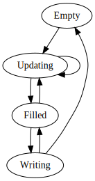

# `io_uring` Go 
**WORK IN PROGRESS** This library adds support for [`io_uring`](https://kernel.dk/io_uring.pdf) for
Go. This library is similar to [liburing](https://github.com/axboe/liburing).
If you want to contribute feel free to send PRs or emails, there's plenty of
things that need cleaned up.

### General Steps
1) Create the `io_uring` buffers
2) Setup mmap for both ring buffers
3) Submit requests, this is done through another system call.

# Interacting with the Submit/Completion Queues
The submission and completion queues are both mmap'd as slices, the question
then becomes how to design an efficient API that is also able to interact with
many of the standard library interfaces. One choice is to run a background
goroutine that manages all operations with the queues and use channels for
enqueuing requests. The downside of this approach is that are [outstanding
issues](https://github.com/golang/go/issues/8899) with the design of channels
may make it suboptimal for high throughput IO.

[`liburing`](https://github.com/axboe/liburing) uses memory barriers for
interacting appropriately with the submission/completion queues of `io_uring`.
One problem with the memory model of Go is that it uses [weak
atomics](https://github.com/golang/go/issues/5045) which can make it difficult
to use `sync/atomic` in all situations. If certain IO operations are to be
carriered out in a specific order then this becomes a real challenge.

The current approach is to use a FSM that uses atomics for synchronization.
Once a ring is "filled" (no writes occuring to any memory locations in the 
mmap'd sumission queue) then the ring may be submitted. This design is not
final and this library is far from ready for general use.



## Example
Here is a minimal example to get started:

```
package main

import (
	"log"
	"os"

	"github.com/hodgesds/iouring-go"
)

func main() {
	r, err := iouring.New(1024)
	if err != nil {
		log.Fatal(err)
	}

	// Open a file for registring with the ring.
	f, err := os.OpenFile("hello.txt", os.O_RDWR|os.O_CREATE|os.O_TRUNC, 0755)
	if err != nil {
		log.Fatal(err)
	}

	// Register the file with the ring, which returns an io.WriteCloser.
	rw, err := r.FileReadWriter(f)
	if err != nil {
		log.Fatal(err)
	}

	if _, err := rw.Write([]byte("hello io_uring!")); err != nil {
		log.Fatal(err)
	}
}
```

## Other References
https://cor3ntin.github.io/posts/iouring/

https://github.com/google/vectorio

https://github.com/shuveb/io_uring-by-example/blob/master/02_cat_uring/main.c

https://golang.org/pkg/syscall/#Iovec
